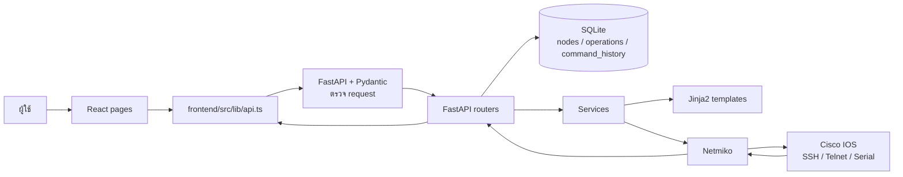
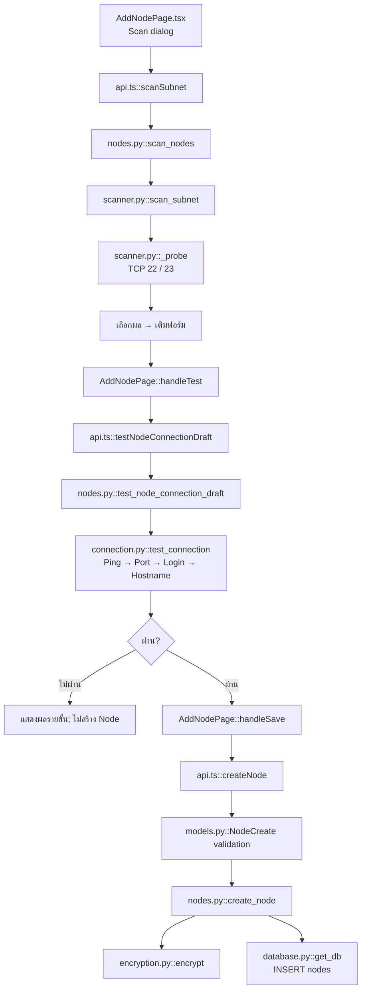
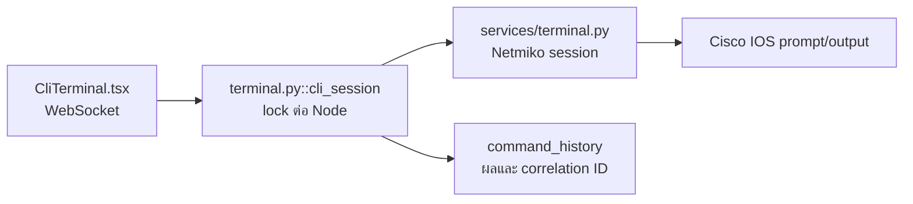
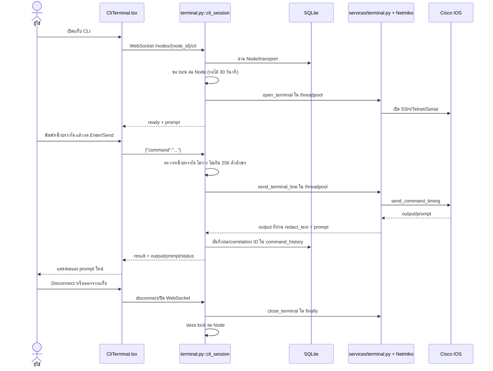
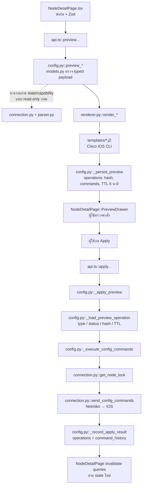

# โครงสร้างไฟล์และหลักการทำงานของ NetConfig

เอกสารนี้อธิบายความรับผิดชอบของไฟล์และเส้นทางข้อมูลจริงในโปรแกรม สำหรับรายการความสามารถดู [FEATURES.md](FEATURES.md) และขั้นตอนใช้งานดู [USER_GUIDE.md](USER_GUIDE.md)

## NetConfig ทำงานอย่างไร — อ่านส่วนนี้ก่อน

NetConfig คือ “หน้าฟอร์มสำหรับสั่ง Cisco IOS” ในแล็บ ผู้ใช้เพิ่มอุปกรณ์ด้วย IP/port และข้อมูลเชื่อมต่อ จากนั้นเลือกสิ่งที่ต้องการตั้งค่า เช่น interface หรือ routing โปรแกรมอ่านค่าปัจจุบันจากอุปกรณ์ สร้างคำสั่งให้ตรวจใน Preview และส่งจริง **เฉพาะเมื่อกด Apply** ผลการส่งถูกเก็บใน History อีกทางหนึ่งคือแท็บ CLI สำหรับส่งคำสั่งทีละบรรทัดทันทีผ่าน session ชั่วคราว; เส้นทางนี้อธิบายแยกด้านล่าง

```text
ผู้ใช้กรอกฟอร์ม
    ↓
React ตรวจข้อมูลเบื้องต้น → ส่งข้อมูลที่กรอก (ไม่ส่ง Cisco CLI)
    ↓
FastAPI ตรวจข้อมูลซ้ำ → อ่าน state ที่จำเป็น → Jinja2 สร้างคำสั่ง
    ↓
Preview ให้ผู้ใช้ตรวจ → ผู้ใช้กด Apply → Netmiko ต่อ SSH/Telnet/Serial ไปยัง IOS
    ↓
IOS ตอบผล → Backend บันทึกผลรายคำสั่ง → หน้าจอโหลดค่าจริงใหม่
```

**อธิบายผังแบบสั้น:** หน้าฟอร์มบอกระบบว่า “ต้องการผลลัพธ์อะไร” ไม่ได้ส่งคำสั่ง IOS ที่ผู้ใช้พิมพ์เอง Backend จึงตรวจข้อมูลและสร้างคำสั่งให้ดูใน Preview ก่อน เมื่อยืนยัน Apply ระบบจึงเปิด connection ชั่วคราวไปทำงาน เก็บผลลัพธ์ แล้วอ่านข้อมูลบนอุปกรณ์ใหม่เพื่อให้หน้าจอสะท้อนสถานะจริง

จำไว้ 3 เรื่อง: **SQLite เก็บ Node/Preview/History แต่ IOS เป็นแหล่งจริงของ config**, **Apply ยังไม่เท่ากับ Save Config ลง startup-config**, และ **EVE-NG เป็นที่อยู่ของเครือข่าย ไม่ใช่ API ที่แอปเรียก** หากต้องการไล่ไฟล์ ให้เริ่มจากหน้าที่ผู้ใช้กด → `frontend/src/lib/api.ts` → router ใน `backend/routers/` → service/template/database ตามผังด้านล่าง

## Tech Stack ที่ใช้และเหตุผล

รายการนี้ตรวจจาก [backend/requirements.txt](../backend/requirements.txt), [frontend/package.json](../frontend/package.json) และโค้ดปัจจุบัน ตัวเลขเวอร์ชันเป็นข้อกำหนดในไฟล์ dependency ไม่ได้ยืนยันเวอร์ชันที่ติดตั้งอยู่บนทุกเครื่อง

| ชั้น | เทคโนโลยีที่ใช้ | ทำหน้าที่ / เหตุผลที่เลือก |
|---|---|---|
| ภาษาและ UI | React 19 + TypeScript | แยกหน้าและฟอร์มเป็น component; type ช่วยให้ข้อมูล Node/Preview/History ที่ UI ใช้ตรงกับ API |
| เครื่องมือพัฒนา UI | Vite 8 | เปิด dev server และ proxy API ไป backend; build หน้าเว็บสำหรับส่งมอบ |
| การเปลี่ยนหน้า | React Router 7 | ผูก URL กับ Dashboard, Add Node, Node Detail และ History |
| ฟอร์มและการตรวจข้อมูล | React Hook Form 7 + Zod 4 | จัดการค่าฟอร์มและแจ้งข้อผิดพลาดทันที; backend ยังตรวจซ้ำด้วย Pydantic |
| ข้อมูลจาก API | TanStack Query 5 + Axios 1 | Query cache/refetch/invalidate หลัง Apply; Axios รวมการเรียก HTTP และแปลง error ให้ UI |
| หน้าตา | Tailwind CSS 4 + `index.css`/design tokens + Lucide React | ทำ layout/status ให้สอดคล้อง Design; ไอคอนช่วยแยกสถานะโดยไม่พึ่งสีอย่างเดียว |
| ภาษาและ API server | Python 3.11+ + FastAPI 0.111 + Uvicorn 0.30 | เปิด HTTP API แบบ async, ผูก request/response schema และให้ frontend เรียกได้ |
| Schema/ค่า environment | Pydantic 2 + pydantic-settings | ตรวจ IP/mask/transport/ค่าฟอร์มฝั่ง server; โหลดและตรวจ `NETCONFIG_*` ตอนเริ่มระบบ |
| ติดต่อ Cisco IOS | Netmiko 4.3 + Paramiko 3.x | ใช้ transport SSH/Telnet/Serial และจัดการ IOS prompt/enable mode; pin Paramiko 3.x เพื่อเข้ากับ IOSv SSH รุ่นเก่าที่ใช้ในแล็บ |
| CLI ระหว่างเปิดแท็บ | Browser WebSocket API + FastAPI WebSocket + Starlette threadpool | ส่งคำสั่ง/ผลลัพธ์ใน session เดียว; ย้าย Netmiko ที่เป็น blocking ไปทำงานใน threadpool โดยไม่เพิ่ม dependency ฝั่งเว็บ |
| ค้นหาสาย Console | pySerial 3.5 | อ่านรายการ COM/tty ที่เครื่อง backend มองเห็นเพื่อให้ผู้ใช้เลือก USB console โดยไม่เปิดพอร์ต |
| สร้างคำสั่ง | Jinja2 3.1 | รวมรูปแบบ CLI ใน template ฝั่ง backend แทนการต่อ string จาก browser |
| เก็บข้อมูล | SQLite (Python stdlib) | เก็บ Node, preview operation และ history ในไฟล์เดียว เหมาะกับโปรเจกต์แล็บเครื่องเดียว |
| เก็บ credential | `cryptography` 42 / Fernet | เข้ารหัส credential ก่อนลง SQLite; key มาจาก environment/`.env` |
| เครื่องมือคุณภาพ | pytest, pytest-asyncio, HTTPX, Ruff, mypy; TypeScript build และ oxlint | ตรวจ API/service แบบไม่ต้องพึ่ง EVE ทุกครั้ง พร้อม lint/type check ทั้ง backend/frontend |

ข้อแลกเปลี่ยนที่ควรรู้: Netmiko เป็น blocking จึงรันงาน I/O ใน threadpool และ lock ต่อ Node; SQLite และรูปแบบการรันนี้ออกแบบมาสำหรับแล็บ ไม่ใช่ระบบหลายเครื่องหรือหลายผู้ใช้; Telnet เองไม่เข้ารหัส traffic แม้รหัสผ่านในฐานข้อมูลจะถูกเข้ารหัส

## วิธีอ่านผัง

ลูกศรทึบหมายถึงการเรียก/ส่งข้อมูลไปขั้นถัดไป; ลูกศรประใน Mermaid หมายถึงการอ่านข้อมูลประกอบที่เกิดเฉพาะบางงาน ชื่อหลัง `::` คือฟังก์ชันจริงที่ค้นได้ในไฟล์นั้น ผังเป็น **เส้นทางหลัก** ไม่ได้แสดงทุก helper หรือทุก error branch

## ภาพรวมระบบ



**อธิบายผังภาพรวม:** เส้นทางขาไปเริ่มที่หน้า React แล้วผ่าน `api.ts` ซึ่งเป็นจุดรวมการเรียก HTTP FastAPI ตรวจ request ด้วย Pydantic ก่อนให้ router ประสานงานกับฐานข้อมูลหรือ service ส่วน service มีงานคนละแบบ: renderer ใช้ Jinja2 สร้างคำสั่ง, connection ใช้ Netmiko ติดต่อ IOS เส้นทางขากลับนำผลอุปกรณ์ผ่าน router/API กลับมาแสดงที่หน้าเว็บ ไม่ได้ให้อุปกรณ์เขียนข้อมูลลงหน้าเว็บโดยตรง

การเปิด URL หรือรีเฟรช `/nodes/:id`, `/nodes/add` และ `/history` เป็นการขอ HTML ของหน้าเว็บ. Vite ใช้ `bypassPageNavigation` ตรวจ GET ที่มี `Accept: text/html` และไม่มี WebSocket upgrade แล้วส่ง `index.html` ให้ React Router เลือกหน้า; request ของ Axios ที่รับ JSON ยังส่งไป backend ตามเส้นทางเดิม. การ deploy frontend ด้วย web server อื่นต้องตั้ง SPA fallback และแยก page navigation/API ในลักษณะเดียวกัน

Frontend ไม่คุยกับ EVE-NG หรืออุปกรณ์โดยตรง และ backend ไม่เรียก EVE API ข้อมูลที่บันทึกใน SQLite เป็น metadata/credential ที่เข้ารหัสและร่องรอยการทำงาน; **ค่าคอนฟิกปัจจุบันของ interface/routing ต้องอ่านจากอุปกรณ์** ไม่ใช่จากรายการ History

## แผนที่ไฟล์แยกตามหมวดและความสำคัญ

```text
NetConfig/
├─ เริ่มระบบ          run-netconfig.bat · README.md · .env.example
├─ frontend/           หน้าจอ → API client → backend
│  └─ src/
│     ├─ main.tsx · App.tsx
│     ├─ pages/         Nodes · AddNode · NodeDetail · History
│     ├─ components/    Sidebar · Topbar · StatusBadge
│     └─ lib/           api.ts · queryClient.ts
├─ backend/            HTTP boundary → services → device / database
│  ├─ main.py · config.py · database.py · models.py
│  ├─ routers/          nodes.py · config.py
│  ├─ services/         connection.py · scanner.py · serial_ports.py · renderer.py · parser.py · encryption.py
│  ├─ templates/        Cisco IOS command templates (*.j2)
│  └─ tests/            API · renderer/parser · fake-device tests
├─ Design/             visual/interaction contract; ไม่ใช่หน้าเว็บที่รัน
└─ docs/               RULE · DECISIONS · CONFIG_COVERAGE · TASKS · คู่มือ
```

**อธิบายผังโฟลเดอร์:** เริ่มที่ `frontend/src/pages/` เมื่ออยากรู้ว่าผู้ใช้กดอะไร, ตามไป `frontend/src/lib/api.ts` เพื่อดู endpoint ที่เรียก แล้วไป `backend/routers/` เพื่อหา handler จากนั้นจึงเปิด `services/`, `templates/` หรือ `database.py` ตามงานที่ handler ส่งต่อ ส่วน `Design/` เป็นตัวอ้างอิง UX ไม่ใช่ source ที่ browser รัน

### A. จุดเริ่มระบบและกติกา

| ไฟล์ | สำคัญเพราะ | เมื่อใดควรเปิดดู |
|---|---|---|
| `run-netconfig.bat` | เปิด backend และ Vite บน Windows; ตรวจบริการเดิมก่อนเปิดซ้ำ | แอปเปิดไม่ได้, port 8000/5175 ชน |
| `README.md` / `.env.example` | บอก dependency, คำสั่งรัน และตัวแปรที่ต้องเตรียม | ติดตั้งเครื่องใหม่หรือ backend ไม่เริ่ม |
| `frontend/vite.config.ts` | กำหนด dev port 5173 และ proxy `/nodes`, `/history`, `/health` ไป backend 8000; GET ที่รับ HTML บน `/nodes`/`/history` โหลด `index.html` เพื่อเปิดหน้า React; `/nodes` เปิด `ws: true` สำหรับ CLI; batch file override UI เป็น 5175 | รีเฟรชหน้าแล้วเห็น JSON หรือ API/WebSocket ไม่ถึง backend |
| `backend/config.py::get_settings` | โหลด `NETCONFIG_*` และตรวจ Fernet key; เป็นแหล่งค่ารัน backend | key, DB path หรือ CORS ผิด |
| `backend/main.py::lifespan` | เตรียม DB ก่อนเปิดบริการ; รวม router และ `/health` | startup ล้มเหลวหรือ endpoint ไม่ปรากฏ |
| `AGENTS.md` / `docs/RULE.md` / `docs/DECISIONS.md` / `docs/TASKS.md` | ข้อกำหนด, decision และสถานะ checkpoint | ก่อนเปลี่ยนโค้ด/contract |
| `Design/DESIGN.md` / `Design/*.html` | หน้าตาและ interaction อ้างอิง; React เป็น implementation จริง | ก่อนเปลี่ยน UI |

### B. Frontend — สิ่งที่ผู้ใช้เห็นและจุดส่ง API

| ไฟล์ | บทบาทและฟังก์ชันหลัก | จุดส่งต่อ |
|---|---|---|
| `frontend/src/main.tsx` | mount React + `QueryClientProvider` | `App.tsx` |
| `frontend/src/App.tsx` | route `/`, `/nodes/add`, `/nodes/:id`, `/history` และ Sidebar | หน้าใน `pages/` |
| `frontend/src/pages/NodesPage.tsx::NodesPage` | ดึงรายการ/ค้นหา Node และตรวจสถานะทุก 30 วินาทีขณะเปิดหน้า | `api.ts::listNodes`, `testNodeConnection` |
| `frontend/src/pages/AddNodePage.tsx::AddNodePage` | wizard, scan popup, test draft และ save หลังผ่าน | `scanSubnet`, `testNodeConnectionDraft`, `createNode` |
| `frontend/src/pages/NodeDetailPage.tsx::NodeDetailPage` | ศูนย์รวม interface, switch/loopback, routing, Show, Preview/Apply, CLI และลบ Node; `PreviewDrawer` แสดงคำสั่ง | ฟังก์ชัน preview/apply/show/capability ใน `api.ts` |
| `frontend/src/components/CliTerminal.tsx` | เปิด WebSocket session, ส่ง CLI ทีละบรรทัด, แสดง prompt/output และ Disconnect | `backend/routers/terminal.py` |
| `frontend/src/pages/HistoryPage.tsx::HistoryPage` | กรอง Node/สถานะ/เวลา, pagination, เปิดรายละเอียด | `listHistory`, `listHistoryNodes` |
| `frontend/src/lib/api.ts` | TypeScript request/response contract, Axios และฟังก์ชัน HTTP ทุกงาน; `extractApiError` แปลง error | `backend/routers/*.py` |
| `frontend/src/lib/queryClient.ts` | ตั้งค่า TanStack Query cache; หน้า invalidates หลัง Apply/Test | หน้าใน `pages/` |
| `frontend/src/components/shared/` | `Sidebar`, `Topbar`, `StatusBadge` | ถูกนำไปใช้หลายหน้า |
| `frontend/src/index.css` | สี ระยะห่าง และ style ของ UI | ทุกหน้า |

### C. Backend boundary, ข้อมูล และอุปกรณ์

| ไฟล์ | บทบาทและฟังก์ชันหลัก | ข้อควรจำ |
|---|---|---|
| `backend/models.py` | `NodeCreate`, `InterfaceConfig`, routing payloads, `PreviewResponse`, `ApplyRequest`, `HistoryEntry` ฯลฯ | Backend เป็นจุดตรวจ input จริง; TypeScript ใน `api.ts` ต้องตรงกัน |
| `backend/routers/nodes.py` | `scan_nodes`, `test_node_connection_draft`, `create_node`, `list_nodes`, `get_node`, `delete_node`, `test_node_connection` | API boundary ของ Node; SQL/การเรียก service อยู่ที่นี่ตามโค้ดปัจจุบัน |
| `backend/routers/config.py` | endpoint interface/routing; `_persist_preview`, `_load_preview_operation`, `_apply_preview`, `show_command`, `list_history` | ไฟล์รวม flow config หลายชนิดและ History; เริ่มหา endpoint ที่นี่ |
| `backend/routers/terminal.py` | WebSocket `/nodes/{id}/cli` และ audit ผลต่อคำสั่ง | CLI เป็น session แยกจากฟอร์ม ไม่เก็บข้อความคำสั่ง/output ลง History |
| `backend/database.py::init_db` / `get_db` | สร้างตารางและเปิด transaction/connection SQLite | ตาราง `nodes`, `operations`, `command_history` |
| `backend/services/connection.py` | `test_connection`, `build_transport_from_row`, `get_node_lock`, `send_config_commands`, `send_show_command` | ติดต่อ IOS ผ่าน Netmiko; lock ต่อ Node, connection อายุสั้น |
| `backend/services/terminal.py` | เปิด/ส่งบรรทัด/ปิด Netmiko session ของ CLI | session ค้างเฉพาะขณะเปิดแท็บ; idle timeout แล้วปิด |
| `backend/services/scanner.py::scan_subnet` | probe TCP 22/23 แบบจำกัด concurrency | ไม่ login หรือบันทึก Node |
| `backend/services/serial_ports.py::list_serial_ports` | อ่านพอร์ต COM/tty ที่ระบบปฏิบัติการของ backend ตรวจพบ เรียง USB ก่อน | ไม่เปิดพอร์ตและไม่ทดสอบ IOS; ใช้เฉพาะ Add Node |
| `backend/services/renderer.py` | `render_*`, `hash_payload`, แปลง typed payload เป็น CLI | ไม่รับ raw CLI จาก browser |
| `backend/services/parser.py` | `parse_show_ip_interface_brief`, `parse_show_interface_detail`, `parse_static_routes`, `parse_*_config`, `parse_show_vlan_brief` | แปลง output จริงเป็น state ที่ฟอร์มใช้ |
| `backend/services/encryption.py` | `encrypt`, `decrypt`, `redact_text` | เก็บ credential ที่เข้ารหัสและลดข้อมูลลับใน audit |
| `backend/templates/*.j2` | คำสั่ง IOS แยกตาม feature และ action เช่น `interface.j2` / `interface_remove.j2` | เปลี่ยน CLI ที่นี่คู่กับ renderer ไม่ประกอบใน React |
| `backend/tests/` | แยก test ตาม phase/feature เช่น `test_nodes_api.py`, `test_history.py`, `test_phase3_*.py` | ตรวจ contract, renderer, parser และ failure path |

## ผังการเริ่มระบบ

```text
run-netconfig.bat
  ├─ backend: python -m uvicorn backend.main:app
  │    └─ main.py::lifespan
  │         ├─ config.py::get_settings → ตรวจ NETCONFIG_FERNET_KEY
  │         └─ database.py::init_db → สร้าง/ปรับ SQLite schema
  └─ frontend: npm run dev → vite.config.ts
       └─ main.tsx → App.tsx → pages/* → lib/api.ts → FastAPI :8000
```

**อธิบายผังเริ่มระบบ:** มีสองโปรเซสแยกกัน: backend ต้องโหลดค่า environment และเตรียมตาราง SQLite ก่อนจึงตอบ API ได้ ส่วน frontend ให้ browser ดาวน์โหลด React แล้วเรียก backend ผ่าน proxy ของ Vite ถ้า UI เปิดได้แต่ข้อมูลไม่ขึ้น ให้ตรวจ `/health` ของ backend ก่อน; ถ้า backend ไม่เริ่ม ให้ดู key/DB path และพอร์ตที่ใช้

เมื่อคลิก batch file UI ใช้พอร์ต 5175; เมื่อรัน `npm run dev` ตามค่า Vite ปกติใช้ 5173 การขอ `/nodes`, `/history` และ `/health` ใน dev จะถูก proxy ไป backend

## ผังการเรียกฟังก์ชันตามงาน

### 1. Scan → Test → Save Node



**อธิบายผังเพิ่ม Node:** Scan ช่วยหา IP ที่เปิด SSH/Telnet และเติมฟอร์มเท่านั้น จากนั้น Test ใช้ข้อมูลในฟอร์มต่อไปยังอุปกรณ์จริงและคืนผลแยก Ping/Port/Login/Hostname โดยยังไม่บันทึก หากผ่านจึงกด Save เพื่อให้ backend ตรวจ payload, เข้ารหัส credential และสร้างแถวใน `nodes` เมื่อ Test ไม่ผ่าน เส้นทางหยุดที่ข้อความผิดพลาด ไม่มี Node ใหม่ในฐานข้อมูล

เมื่อเลือก Serial มีทางเข้าฟอร์มอีกเส้น: `AddNodePage.tsx` → `api.ts::listSerialPorts` → `nodes.py::get_serial_ports` → `serial_ports.py::list_serial_ports` → pySerial อ่านพอร์ตจากเครื่อง backend → UI แสดงชื่อพอร์ตและคำอธิบายให้เลือก รายการนี้รีเฟรชได้และไม่เปิดพอร์ต; ขั้น Test Connection เดิมจึงเป็นตัวตรวจว่าเข้า IOS ได้จริง

วิธีไล่ไฟล์: ถ้าสแกนไม่พบให้เริ่ม `AddNodePage.tsx::selectScanResult`/`scanSubnet` → `nodes.py::scan_nodes` → `scanner.py::_probe`; ถ้า Ping ผ่านแต่ Login ไม่ผ่าน ให้ดู `test_node_connection_draft` → `connection.py::test_connection`/`build_device_dict`; ถ้ากด Save แล้วผิดพลาดให้ดู `create_node`, `NodeCreate`, `encrypt` และตาราง `nodes`

> ข้อจำกัดของ contract: UI บังคับ Test ก่อน Save แต่ `POST /nodes` เป็น endpoint แยกและไม่ได้ทดสอบ connection ซ้ำเอง สถานะเริ่มต้น `connected` อาศัยผล test ที่ UI ทำก่อนหน้า

### 2. Dashboard / Reconnect / สถานะ Node

```text
NodesPage.tsx::NodesPage   หรือ   NodeDetailPage.tsx::NodeDetailPage
  → api.ts::listNodes / getNode
  → nodes.py::list_nodes / get_node
  → database.py::get_db → ตาราง nodes

ทุก ~30 วินาทีขณะเปิดหน้า:
  → api.ts::testNodeConnection
  → nodes.py::test_node_connection
  → connection.py::build_transport_from_row → test_connection
  → nodes.py อัปเดต nodes.status → UI แสดง Connected / Unreachable
```

**อธิบายผังสถานะ:** การเปิดหน้าเริ่มจากอ่านรายการ/รายละเอียด Node ใน SQLite แล้วการตรวจซ้ำจะใช้ credential ที่บันทึกไว้ทดสอบอุปกรณ์ ผลรอบล่าสุดถูกเขียนเป็นสถานะใหม่ใน `nodes` และส่งให้ UI แสดง จึงไม่ต้องมี SSH session ค้างไว้ตลอด; หากเครื่องหลุดหลังตรวจผ่าน สถานะอาจยังเป็น Connected จนกว่าจะตรวจรอบถัดไป

`nodes.status` คือผลครั้งล่าสุด ไม่ใช่ socket ที่เปิดค้าง ถ้าการ polling ล้มเหลวชั่วคราว UI อาจคงค่าสถานะจาก DB/ผลก่อนหน้าไว้เพื่อไม่กระพริบเป็น Unknown

### 3. อ่านข้อมูลอุปกรณ์ก่อนกรอกฟอร์ม

```mermaid
flowchart LR
    A["NodeDetailPage.tsx"] --> B["api.ts::showCommand<br/>show ip interface brief"]
    B --> C["config.py::show_command"]
    C --> D["connection.py::send_show_command"]
    D --> E["parser.py::parse_show_ip_interface_brief"]
    E --> F["รายการ interface ใน UI"]
    F --> G["ผู้ใช้เลือก interface"]
    G --> H["api.ts::getInterfaceCurrent"]
    H --> I["config.py::get_interface_current"]
    I --> J["connection.py::send_show_commands<br/>show interfaces + show ip interface"]
    J --> K["parser.py::parse_show_interface_detail"]
    K --> L["เติม IP / mask / description / admin state"]
```



**อธิบายผังอ่าน Interface:** คำสั่ง `show ip interface brief` ให้รายชื่อ interface สำหรับ dropdown แต่ข้อมูลนั้นไม่ครบสำหรับเติมทุกช่อง เมื่อผู้ใช้เลือก interface จึงเรียก endpoint อีกครั้งเพื่ออ่านรายละเอียดของพอร์ตนั้น แล้ว parser แปลง output เป็น IP, mask, description และ admin state ที่ฟอร์มใช้ หากอ่านหรือ parse ไม่ได้ UI ไม่ควรเดาค่าแทนอุปกรณ์

สำหรับ Switch ยังมี `api.ts::getDeviceCapabilities`/`getInterfaceCapabilities`/`listVlans` → endpoint ชื่อเดียวกันใน `config.py` → `connection.py` อ่าน Show; capability ของเครื่องตรวจ output ที่ไม่รองรับด้วย `parser.py::is_unsupported_ios_command`, capability ของพอร์ตใช้ `parse_switchport_state` และรายการ VLAN ใช้ `parse_show_vlan_brief` ก่อนเปิด control ที่เกี่ยวข้อง ชนิด Node ที่บันทึกเป็น Switch คุมการแสดง UI แต่ backend ตรวจ capability จากอุปกรณ์จริงอีกชั้น

สำหรับ routing: `RoutingPanel` ใน `NodeDetailPage.tsx` เรียก `listStaticRoutes` / `getRipState` / `getOspfState` / `getEigrpState` / `getBgpState` ใน `api.ts` แล้ว endpoint ใน `config.py` อ่าน running-config ผ่าน `send_show_command(s)` และแปลงด้วย `parse_static_routes` / `parse_rip_config` / `parse_ospf_config` / `parse_eigrp_config` / `parse_bgp_config` ผลนี้เป็นค่าที่อุปกรณ์รายงานขณะอ่าน ไม่ใช่ค่าที่ History คาดการณ์ การอ่าน running-config ไม่ต้องมี IP บน interface; `connection.py::_open_connection` จะลอง `enable` แม้ไม่ได้กรอก secret เพราะ console อาจเข้าได้โดยไม่ถามรหัส ถ้าอ่านไม่สำเร็จ UI แสดง “อ่านไม่ได้” ไม่แทนด้วย Off

### CLI แบบ session ชั่วคราว



**อธิบายผัง CLI:** เมื่อเปิดแท็บ CLI หน้าเว็บเชื่อม WebSocket ไป backend แล้ว backend เปิด Netmiko session สำหรับ Node นั้น คำสั่งส่งทีละบรรทัดและได้ prompt/output กลับมา session ปิดเมื่อออกจากแท็บ กด Disconnect หรือไม่ได้ใช้งานเกิน 5 นาที History เก็บผลและ correlation ID แต่ไม่เก็บข้อความคำสั่ง/output ที่อาจมีรหัสผ่าน เส้นทางนี้แยกจากฟอร์ม Preview/Apply และคำสั่งมีผลทันที

#### ลำดับการทำงานและข้อมูลที่ส่งจริง



**อธิบายผังลำดับ CLI:** `NodeDetailPage.tsx` mount `CliTerminal` เฉพาะตอนเปิดแท็บ CLI; browser สร้าง `ws://` หรือ `wss://` ตามหน้าเว็บ และใช้ host เดียวกับ UI. ในโหมด Vite, `vite.config.ts` proxy เส้นทาง `/nodes` รวม WebSocket ไป FastAPI ที่พอร์ต 8000. `backend/main.py` ลงทะเบียน router นี้ไว้ ส่วน `terminal.py::cli_session` อ่าน Node จาก SQLite, รอ lock ต่อ Node, สร้าง transport จากข้อมูลที่บันทึก แล้วเรียก `services/terminal.py::open_terminal` ผ่าน threadpool เพราะ Netmiko เป็น blocking. เมื่ออ่าน prompt ได้จึงส่งข้อความ `ready` กลับมา; ถ้าเปิดไม่ได้ UI แสดง error และให้เชื่อมใหม่

หนึ่ง WebSocket ใช้หนึ่ง Netmiko connection ตลอดช่วงเปิด CLI. Frontend ส่ง JSON `{ "command": "..." }` ทีละบรรทัดและรอผลก่อนให้ส่งบรรทัดถัดไป Backend ตรวจความยาว/รูปแบบ แล้ว `send_terminal_line` ใช้ `send_command_timing` (รอผลคำสั่งได้สูงสุด 20 วินาที) และอ่าน prompt ใหม่; ถ้า output จบด้วย `Password:` จะส่งสถานะให้ช่องกรอกเป็นชนิด password. Output ผ่าน `redact_text` ก่อนตอบ UI และคำสั่งที่ดูเหมือนมี password/secret หรือเป็นคำตอบของ password prompt จะไม่ถูก echo/เก็บในประวัติคำสั่งของหน้าจอ. คีย์ ↑↓ เรียกคำสั่งที่เคยพิมพ์ในแท็บ, Esc ล้างช่องพิมพ์, Copy/Clear จัดการเฉพาะข้อความที่แสดง ไม่สั่ง IOS

หลังส่งหนึ่งบรรทัด `cli_session` ตรวจรูปแบบ error ของ IOS เพื่อกำหนด `success`/`failed`, สร้าง correlation ID และเขียน `command_history` ก่อนส่ง `result` กลับมา. History เก็บสถานะและ Node แต่แทนข้อความคำสั่ง/output ด้วย placeholder; หน้า History จึงใช้ตรวจผลย้อนหลังได้ แต่ใช้ย้อนดูข้อความ CLI ไม่ได้. การตรวจ error นี้อาศัยข้อความตอบกลับที่รู้จัก ไม่ใช่การรับประกันว่าคำสั่งเปลี่ยน config ถูกต้องทุกมิติ; หากต้องตรวจ state ให้ใช้ Show หรืออ่านค่าอุปกรณ์จริงอีกครั้ง

การกด Disconnect, เปลี่ยนแท็บ, ปิดหน้า, WebSocket หลุด หรือไม่มีข้อความเข้ามา 300 วินาที จะจบ session; `finally` ปิด Netmiko connection และปล่อย lock. ระหว่างเปิด CLI หน้า Node Detail หยุด health polling และปิดปุ่ม Reconnect/Save Config/Delete Node ของส่วนหัวเพื่อลดงานที่ชน lock. สถานะ Connected ในแถบ CLI หมายถึง WebSocket session นี้พร้อมใช้ ส่วนสถานะ Node ใน Dashboard เป็นผลตรวจ connection ครั้งล่าสุดคนละค่า. CLI ส่งคำสั่งทันทีโดยไม่มี Preview/Apply และไม่สั่ง `write memory` ให้อัตโนมัติ; หากต้องบันทึก startup-config ให้ใช้ Save Config แยกต่างหาก

#### จุดเริ่มตรวจเมื่อ CLI ไม่ทำงาน

| อาการ | ไล่ไฟล์ / จุดตรวจ |
|---|---|
| เปิดแท็บแล้วไม่ Connected | `CliTerminal.tsx` (WebSocket URL/error) → `vite.config.ts` (`/nodes` ต้อง proxy WebSocket) → `main.py` (ลงทะเบียน router) → `routers/terminal.py::cli_session` (Node, lock, open) → `services/terminal.py::open_terminal` |
| Connected แต่ส่งแล้วไม่เห็นผล | `CliTerminal.tsx::send`/`onmessage` → `routers/terminal.py::cli_session` (validation/error) → `services/terminal.py::send_terminal_line` → IOS prompt/output |
| อีกงานบน Node ติดว่ากำลังใช้งาน | `routers/terminal.py::cli_session` ถือ `connection.py::get_node_lock` ตลอด session; ออกจากแท็บหรือกด Disconnect แล้วตรวจว่า `finally` ปิด connection/ปล่อย lock |
| หน้า History มีผลแต่ไม่มีข้อความ CLI | `routers/terminal.py::_record_cli_result` บันทึกเพียงผลและ correlation ID ตาม ADR-037; เป็นพฤติกรรมที่ตั้งใจไว้ |

### 4. Preview → Apply → History (เส้นทางร่วมของ config ทุกชนิด)



**อธิบายผัง Preview/Apply:** ฝั่งซ้ายถึง `_persist_preview` คือขั้น “เตรียมและเก็บข้อเสนอ” จึงยังไม่มีการเปลี่ยน config; บางฟีเจอร์อาจอ่านข้อมูลจริงแบบ read-only เพื่อกันค่าซ้ำหรือคำสั่งที่อุปกรณ์ไม่รองรับ หลังผู้ใช้ตรวจ CLI ใน `PreviewDrawer` และกด Apply ฝั่ง backend จะโหลด operation เดิม ตรวจชนิด/สถานะ/hash/อายุ แล้วล็อก Node และส่งคำสั่งจาก operation ที่เก็บไว้ ผลสำเร็จหรือผิดพลาดแต่ละคำสั่งถูกเขียนลง History ก่อน UI โหลดข้อมูลใหม่

**Preview ไม่เปลี่ยน config** แต่ไม่ใช่ทุก Preview ที่ offline: บางประเภทอ่าน state/capability ปัจจุบันเพื่อเช็ก duplicate/conflict ก่อนสร้างคำสั่ง Apply ส่งเฉพาะ commands ของ operation ที่เก็บไว้ใน SQLite และตรวจ `operation_id` กับ `payload_hash` ที่ผู้ใช้ส่งมา; ไม่รับ `commands: string[]` จาก browser หาก IOS ตอบ CLI error ระหว่างหลายคำสั่ง ระบบบันทึก `failed`/`partial_failed` ตามจริง ไม่ rollback คำสั่งที่ผ่านแล้ว

#### ตารางเริ่มไล่ไฟล์ตามชนิดงาน

| งานที่ผู้ใช้กด | จุดเริ่ม frontend (`NodeDetailPage.tsx` → `api.ts`) | Endpoint/function ใน `config.py` → renderer → template |
|---|---|---|
| Interface IPv4 | `InterfacesPanel` → `previewInterface` / `applyInterface` | `preview_interface` → `render_interface_commands` → `interface.j2`; Apply → `apply_interface` |
| Toggle port | `InterfacesPanel` → `previewInterfaceAdmin` / `applyInterfaceAdmin` | `preview_interface_admin` → `render_interface_admin_commands` → `interface_admin.j2` |
| Loopback | `LoopbackPanel` → `previewLoopback` / `previewLoopbackRemove` | `preview_loopback` / `preview_loopback_remove` → `render_loopback_commands` / `render_loopback_remove` → `loopback*.j2` |
| Switch access port | `AccessPortPanel` → `previewAccessPort` / `applyAccessPort` | `preview_access_port` → `render_access_port_commands` → `access_port.j2` |
| Switch routed port | `RoutedPortPanel` → `previewRoutedPort` / `previewRoutedPortRestore` | `preview_routed_port` / `preview_routed_port_restore` → `render_routed_port_commands` / `render_routed_port_restore` → `routed_port*.j2` |
| VLAN / SVI | `VlanSviPanel` → `previewVlan` / `previewSvi` (และ Remove) | `preview_vlan` / `preview_svi` (และ Remove) → `render_vlan_commands` / `render_svi_commands` → `vlan*.j2` / `svi*.j2` |
| Static/default route | `RoutingPanel` → `previewStaticRoute` / `applyStaticRoute` | `preview_static_route` (หรือ update/remove) → `render_static_route` → `static_route*.j2` |
| RIP / OSPF / EIGRP | `RoutingPanel` → `previewRipNetwork` / `previewOspfNetwork` / `previewEigrpNetwork` | `preview_*_network` (หรือ update/remove/process remove) → `render_*` → `rip*.j2` / `ospf*.j2` / `eigrp*.j2` |
| BGP | `RoutingPanel` → `previewBgpNeighbor` / `previewBgpNetwork` | `preview_bgp_neighbor` / `preview_bgp_network` (หรือ update/remove) → `render_bgp_*` → `bgp*.j2` |
| Save Config | ปุ่ม Save → `previewSaveConfig` / `applySaveConfig` | `preview_save_config` → `render_save_config` → `save_config.j2` → Apply ส่ง `write memory` |

ชื่อ `apply_*` ของแต่ละงานใน `config.py` สุดท้ายเรียก `_apply_preview` ร่วมกัน จึงควรเริ่ม debug ปัญหา operation หมดอายุ/hash ไม่ตรง/CLI ล้มเหลวที่สามฟังก์ชัน `_load_preview_operation` → `_execute_config_commands` → `_record_apply_result`

### 5. Show และ History

```text
NodeDetailPage::ShowPanel
  → api.ts::showCommand
  → config.py::show_command → ตรวจ _SHOW_COMMANDS allowlist
  → connection.py::get_node_lock → send_show_command → Cisco IOS
  ├─ parser.py::parse_show_ip_interface_brief / parse_show_ip_route (เมื่อรองรับ)
  ├─ config.py::_record_show_result → command_history
  └─ ShowResponse → ShowPanel

HistoryPage::HistoryPage
  → api.ts::listHistory / listHistoryNodes (+ listNodes เพื่อชื่อปัจจุบัน)
  → config.py::list_history / list_history_nodes
  → database.py::get_db → command_history + nodes
  → กรอง Node/สถานะ/เวลา → นับทั้งหมด → LIMIT/OFFSET → UI ตาราง/การ์ด
```

**อธิบายผัง Show/History:** Show เป็นการอ่านค่าจากอุปกรณ์ตามรายการคำสั่งที่อนุญาต ผลที่ parse ได้จะแสดงแบบมีโครงสร้าง ส่วน output อื่นแสดงเป็นข้อความ และการเรียก Show ถูกเพิ่มใน History ด้วย หน้า History ไม่เชื่อม IOS อีกครั้ง: อ่าน `command_history` ใน SQLite, กรองก่อนนับจำนวนและแบ่งหน้า แล้วจับคู่ชื่อ Node ปัจจุบันหรือชื่อ snapshot ที่เก็บไว้ตอนทำรายการ

`show_command` รับเฉพาะคำสั่งใน allowlist; parsed data มีสำหรับ `show ip interface brief` และ `show ip route` ส่วนคำสั่งอื่นคืน raw output ประวัติ Show บันทึกทั้ง success/failure แบบ redact ชื่อ Node ในหน้า History ใช้ชื่อปัจจุบันถ้ายังมี Node และใช้ชื่อ snapshot หาก Node ถูกลบแล้ว

## ข้อมูลแต่ละชนิดอยู่ที่ไหน

| ข้อมูล | แหล่งจริง / ตาราง | ไฟล์ที่อ่านหรือเขียน | ใช้ทำอะไร |
|---|---|---|---|
| Node/transport/credential ที่เข้ารหัส/สถานะล่าสุด | SQLite `nodes` | `nodes.py` ↔ `database.py::get_db`; `encryption.py` | Dashboard, Test, เตรียม connection |
| Preview ที่ยัง Apply ได้ | SQLite `operations` | `config.py::_persist_preview`, `_load_preview_operation` | เก็บ command, operation type, payload hash, อายุ 5 นาที |
| ผล config/Show ย้อนหลัง | SQLite `command_history` | `config.py::_record_apply_result`, `_record_show_result`, `list_history` | Audit/History; ไม่ใช่ actual running-config |
| Interface/routing/VLAN ปัจจุบัน | Cisco IOS running-config/Show output | `connection.py::send_show_command(s)` → `parser.py` | เติมฟอร์ม/ตรวจ state จริง |
| ข้อมูลบนหน้าจอที่โหลดไว้ | TanStack Query ใน browser | `queryClient.ts` + หน้า React | แสดงเร็วขึ้น; invalidate/refetch หลังเปลี่ยนค่า ไม่ใช่ source of truth |
| ค่าที่อยู่หลัง reboot | Cisco IOS startup-config | `preview_save_config` → `apply_save_config` | เกิดเมื่อยืนยัน Save Config แยกต่างหาก |

## เปิดไฟล์ไหนก่อนเมื่อเจอปัญหา

| อาการ | ไล่จากไฟล์นี้ → ไปไฟล์นี้ |
|---|---|
| เปิดแอปหรือ API ไม่ขึ้น | [run-netconfig.bat](../run-netconfig.bat) → [backend/main.py](../backend/main.py) → [backend/config.py](../backend/config.py) → [backend/database.py](../backend/database.py) |
| เพิ่ม Node ไม่ได้/ทดสอบไม่ผ่าน | [AddNodePage.tsx](../frontend/src/pages/AddNodePage.tsx) → [api.ts](../frontend/src/lib/api.ts) → [nodes.py](../backend/routers/nodes.py) → [connection.py](../backend/services/connection.py) |
| Scan ไม่เจอ | [AddNodePage.tsx](../frontend/src/pages/AddNodePage.tsx) → [nodes.py](../backend/routers/nodes.py) → [scanner.py](../backend/services/scanner.py) |
| ฟอร์ม interface ไม่ขึ้นค่าปัจจุบัน | [NodeDetailPage.tsx](../frontend/src/pages/NodeDetailPage.tsx) → [config.py](../backend/routers/config.py) (`get_interface_current`) → [connection.py](../backend/services/connection.py) → [parser.py](../backend/services/parser.py) |
| Preview ไม่ออกหรือคำสั่งไม่ตรง | [NodeDetailPage.tsx](../frontend/src/pages/NodeDetailPage.tsx) → [models.py](../backend/models.py) → [config.py](../backend/routers/config.py) → [renderer.py](../backend/services/renderer.py) → [templates/](../backend/templates/) |
| Apply ถูกปฏิเสธ/CLI ล้มเหลว | [config.py](../backend/routers/config.py) (`_load_preview_operation`/`_execute_config_commands`) → [connection.py](../backend/services/connection.py) → [database.py](../backend/database.py) |
| History ชื่อ Node/ตัวกรอง/หน้าไม่ตรง | [HistoryPage.tsx](../frontend/src/pages/HistoryPage.tsx) → [api.ts](../frontend/src/lib/api.ts) → [config.py](../backend/routers/config.py) (`list_history`/`list_history_nodes`) → [database.py](../backend/database.py) |

## ถ้าจะเพิ่มฟีเจอร์หนึ่งรายการ ต้องแตะส่วนใด

1. ดู scope/checkpoint ใน `docs/TASKS.md` และ decision ใน `docs/DECISIONS.md`; ถ้าแตะ UI ให้อ่าน `Design/DESIGN.md` กับ HTML ที่เกี่ยวข้อง
2. กำหนด input/output และ validation ใน `backend/models.py`
3. เพิ่ม/ปรับแม่แบบใน `backend/templates/` และการ render ใน `backend/services/renderer.py`; หากต้องอ่าน state จริงให้ปรับ `parser.py`
4. เพิ่ม API ใน router ที่เหมาะสม โดยใช้ `connection.py` สำหรับอุปกรณ์และบันทึก operation/history ตาม flow Preview/Apply
5. ปรับ TypeScript contract ใน `frontend/src/lib/api.ts` แล้วค่อยต่อฟอร์ม/ผลลัพธ์ในหน้า React
6. เพิ่มการทดสอบเฉพาะพฤติกรรมที่เปลี่ยนและอัปเดต Design/decision/checkpoint ที่เกี่ยวข้อง; อย่าแก้ mock HTML แทน production UI
